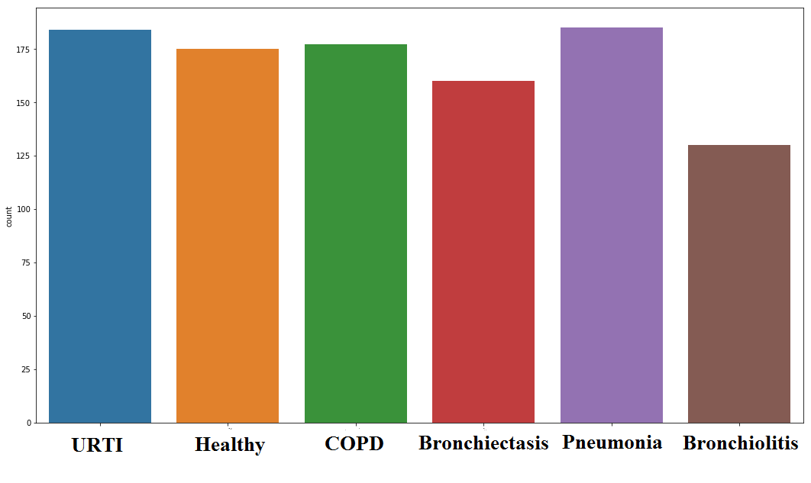
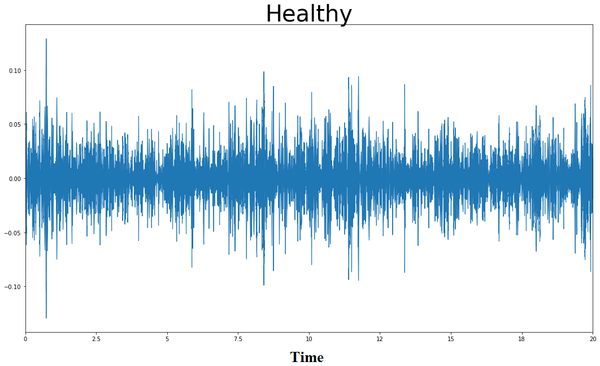
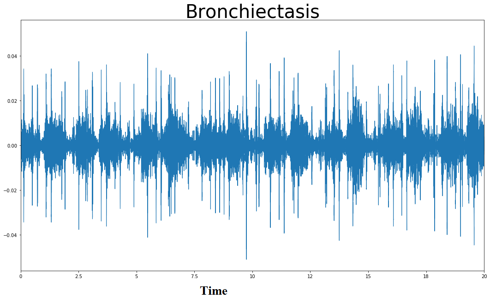
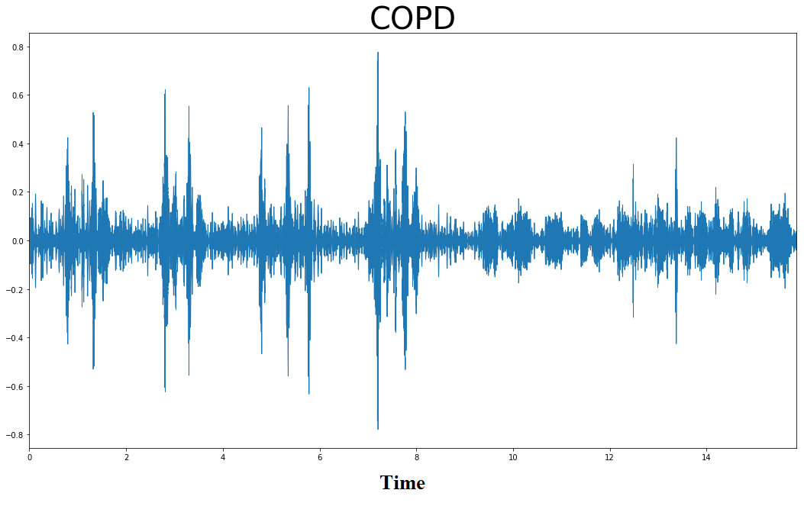
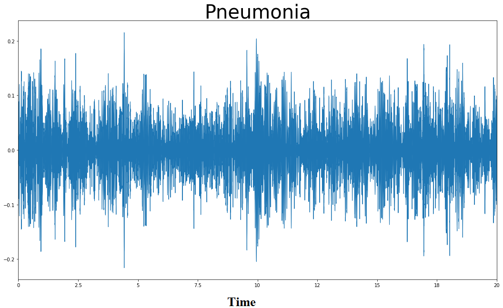
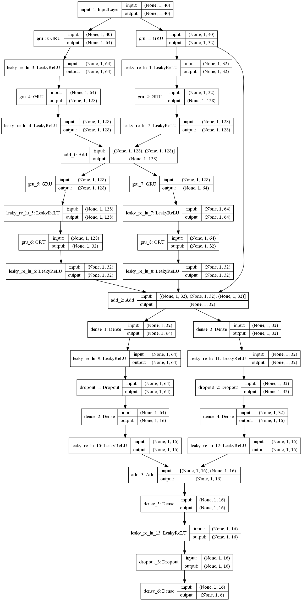
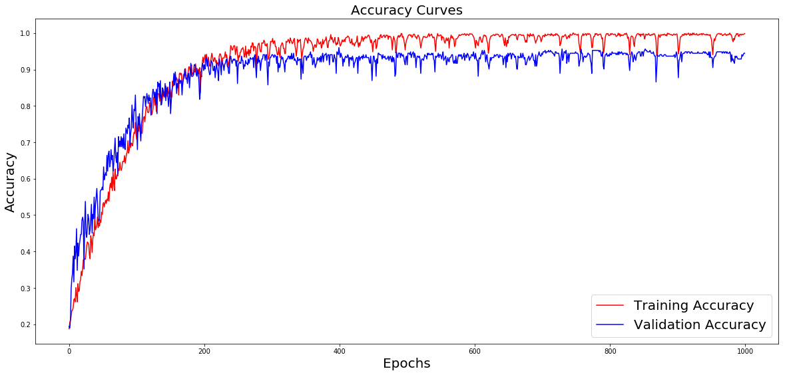
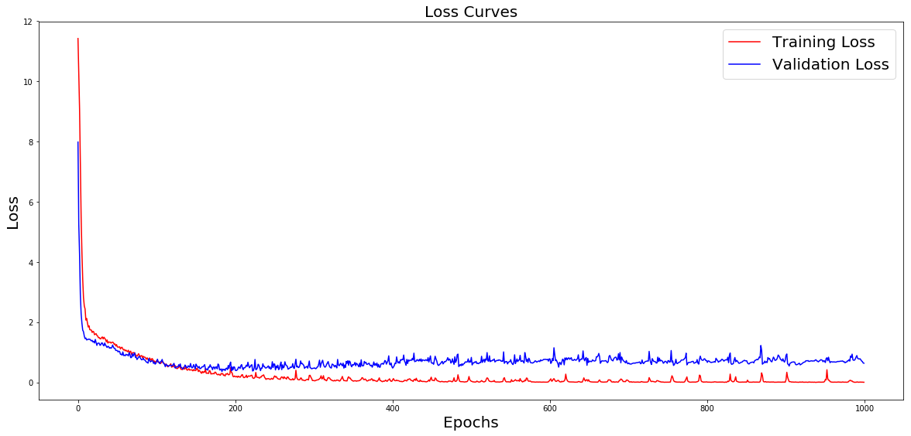

## Respiratory diseases recognition through respiratory sound with the help of deep neural network

Link to the research paper - <a href="https://ieeexplore.ieee.org/document/9080747">10.1109/CINE48825.2020.234388</a>

## Authors
1. Victor Basu<br>
Department of Computer Science and Engineering<br>
Jalpaiguri Government Engineering College<br>
West Bengal, India<br>
basu369victor@gmail.com<br>

2. Srinibas Rana,Assistant Professor<br>
Department of Computer Science and Engineering<br>
Jalpaiguri Government Engineering College<br>
West Bengal, India<br>
srinibas.rana123@gmail.com<br>


>📋  Abstract:
Prediction of respiratory diseases such as COPD(Chronic obstructive pulmonary disease), URTI(upper respiratory tract infection), Bronchiectasis, Pneumonia, Bronchiolitis with the help of deep neural networks or deep learning. We have constructed a deep neural network model that takes in respiratory sound as input and classifies the condition of its respiratory system. It not only classifies among the above-mentioned disease but also classifies if a person’s respiratory system is healthy or not with higher accuracy and precision.

## INTRODUCTION

In this research paper, we are going to discuss how deep learning could be used in the recognition of respiratory disease just from the respiratory sound. Respiratory audios are important indicators of respiratory health and respiratory disorder. For example, a wheezing sound is a common sign that a patient has an obstructive airway disease like asthma or chronic obstructive pulmonary disease (COPD). We have approached the problem with different neural network model architecture, and choose the model with would give us the best possible results, we also performed data augmentation over the data-set. The data-set we have used consists of respiratory sounds taken from different patients from different locations around the chest. We have used **Accuracy score**, **Precision score**, **Recall score**, **f1-score**, **Cohen’s kappa score**, **Matthews correlation coefficien** as metrics to evaluate and compare the performance of different models against the same data-set. With this model we have achieved an accuracy of 95.67% ± 0.77%,precision of 95.89% ± 0.8%, Sensitivity of 95.65% ± 0.753%,f1-score of 95.66% ± 0.79%, Cohen’s kappa score of 94.74% ± 0.96% and Matthews correlation coefficient of 94.79% ± 0.96%.

## About the Dataset

Details about the collector and maintainer of the database is explained in reference [1] and [11]. These recordings were taken from 126 patients. It includes 920 annotated recordings of varying length from 10s to 90s.There are a total of 5.5 hours of recordings containing 6898 respiratory cycles - 886 contain wheezes, 1864 contain crackles and 506 contain both crackles and wheezes. The patients span all age groups - children, adults and the elderly. The respiratory sounds in the dataset are of different category such as Healthy, COPD(Chronic
obstructive pulmonary disease), URTI(upper respiratory tract infection), Bronchiectasis, Pneumonia, Bronchiolitis, Asthma, LRTI(Lower respiratory tract infection) which would be classified or predicted by out neural network model. Here healthy category means respiratory sound taken from a healthy person and other categories represents the sound taken from the patient suffering from their respective conditions. The dataset could be found at ICBHI 2017 Challenge[12].

## Data Pre-processing

The first problem we faced with the data-set was data imbalance. In the data-set, we got only one case for Asthma and only two cases for LRTI. Therefore we removed the rows corresponding to the respective classes for better performance of our model. Now, we are left with six classes.The data-set was still imbalanced. COPD had a much higher number of cases than other classes in the data-set, therefore we performed
data augmentation with other classes in the data-set. In data augmentation we added random noise to the audio
data, shifted the audio data both by using numpy library and also applied time-stretch using librosa to the audio data. In this data-set, the audio was recorded from different locations around the chest for every single patient so in case of COPD, we considered a maximum three locations for every single patient to balance the data-set.
<br>

We extracted Mel-frequency cepstral coefficients( spectral features ), from the audio data. 40 features are extracted from each audio data and used to train the model. Visualizations of the waveplot of the sound file we have used in our research.





## Model Architecture



## Model Performance
While compiling the model Categorical Cross-entropy is
used as the loss function. We have also used Adamax as our
Optimizer or optimizing algorithm.


<br>

We have performed our experiment twenty times, and selected unique readings from them for this research paper as shown in TABLE-1. We validated our model performance with the best model weight concerning
the validation score during training the model. The model was trained for 1000 iterations.

Table - 1
Model Evaluation

| | accuracy | precision | recall | f1-score | CK | MCC |
|--| -------- | --------- | ------ | --------- | -- | --- |
|1 | 0.9525 | 0.9548 | 0.9526 | 0.9522 | 0.9426 | 0.9432 |
|2 | 0.9567 | 0.9589 | 0.9565 | 0.9566 | 0.9474 | 0.9479 |
|3 | 0.9605 | 0.9621 | 0.9605 | 0.9604 | 0.9521 | 0.9525 |s
|4 | 0.9490 | 0.9507 | 0.9486 | 0.9485 | 0.9378 | 0.9383 |
|5 | 0.9486 | 0.9509 | 0.9486 | 0.9487 | 0.9378 | 0.9382 |
|6 | 0.9604 | 0.9623 | 0.9605 | 0.9603 | 0.9522 | 0.9526 |
|7 | 0.9565 | 0.9589 | 0.9565 | 0.9566 | 0.9474 | 0.9479 |
|8 | 0.9604 | 0.9618 | 0.9605 | 0.9604 | 0.9521 | 0.9525 |
|9 | 0.9565 | 0.9599 | 0.9565 | 0.9566 | 0.9474 | 0.9480 |
|10 | 0.9604 | 0.9625 | 0.9605 | 0.9601 | 0.9520 | 0.9534 |

The overall performance of our model over unknown data or validation data are:

1. Accuracy: 95.67% ± 0.77%
2. Precision: 95.89% ± 0.8%
3. Recall/Sensitivity: 95.65% ± 0.753%
4. f1-score: 95.66% ± 0.79%
5. Cohens kappa score: 94.74% ± 0.96%
6. Matthews correlation coefficient: 94.79% ± 0.96%

## Classification report

|     | precision | recall | f1-score | Support |
| --- | --------- | ------ | -------- | ------- |
| Bronchiectasis | 0.98 | 1.00 | 0.99 | 44 |
| Bronchiolitis | 1.00 | 1.00 | 1.00 | 30 |
| COPD | 1.00 | 0.91 | 0.95 | 57 |
| Healthy | 0.94 | 0.92 | 0.93 | 36 |
| Pneumonia | 0.92 | 1.00 | 0.96 | 36 |
| URTI | 0.94 | 0.96 | 0.94 | 53 |
| --- | --------- | ------ | -------- | ------- |
| --- | --------- | ------ | -------- | ------- |
| macro avg | 0.96 | 0.97 | 0.96 | 253 |
| weighted avg | 0.96 | 0.96 | 0.96 | 253 |

## Comparison of our model performance with previous research papers

First of all the model that we have created is a multi-class classifier that classifies six different classes and also we have used six different metrics to evaluate the performance of our model. We are proud to declare that our model is the very class six class classifier model compared to the previous research papers, which itself is an improvement in the field of medical science and A.I.<br>

The research papers shown below might not be a multi-label classifier or might not use the same parameters for evaluating their respective models.

1. Detection of explosive cough events in audio recordings by internal sound analysis. [1]. sensitivity - 92.3% ± 2.3%; specificity - 84.7% ± 3.3% .
2.  Detection of crackle events using a multi-feature approach .[2]. sensitivity - 76%; precision - 77%.
3. Integrated approach for automatic crackle detection based on fractal dimension and box filtering .[11]. Sensitivity - 89% ± 10%; positive predictive value - 95% ± 11%; F-score - 92% ± 10%
4. Detection of Lungs Status Using Morphological Complexities of Respiratory Sounds.[5]. Accuracy - 92.86%; sensitivity - 86.30%; specificity - 86.90%.
5. An Expert Diagnostic System to Automatically Identify Asthma and Chronic Obstructive Pulmonary Disease in Clinical Settings. [9]. Sensitivity - 96.45%;
sensitivity - 96%; specificity - 98.71%.
6. Lung disease detection using feature extraction and
extreme learning machine.[10]. Accuracy - 96%

## Citation
If you use the code in your research, we would appreciate a citation to the original paper:
```
V. Basu and S. Rana, "Respiratory diseases recognition through respiratory sound with the help of deep neural network," 2020 4th International Conference on Computational Intelligence and Networks (CINE), Kolkata, India, 2020, pp. 1-6, doi: 10.1109/CINE48825.2020.234388.
```
```
@INPROCEEDINGS{9080747,

  author={V. {Basu} and S. {Rana}},

  booktitle={2020 4th International Conference on Computational Intelligence and Networks (CINE)}, 

  title={Respiratory diseases recognition through respiratory sound with the help of deep neural network}, 

  year={2020},

  volume={},

  number={},

  pages={1-6},

  doi={10.1109/CINE48825.2020.234388}}
```
